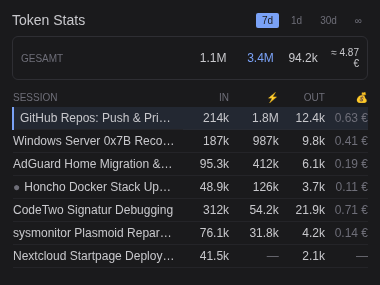

# hermes-token-stats

Hermes Desktop plugin: statusbar chip + pane for per-session token usage.

## Features

**Statusbar chip** (live readout of the focused session):
- 🪙 **Tokens** — session lifetime total (input/cached/output in tooltip)
- ⚡ **Cache** — prompt-cache hit rate (from `cache_read` / prompt tokens)
- 📊 **Context** — context window fill % (amber ≥75%, red ≥90%), merged from
  `session.context_breakdown` RPC so resumed sessions show a value too
- 💰 **Cost** — client-side EUR estimate (USD table × 0.85), 2 decimals;
  `null` (no display) for unpriced models — never a fabricated number
- 🔁 **API-Calls** — lifetime provider request count

Every metric is toggleable via a click menu on the chip (popover, ●/○ state);
the selection persists via `ctx.storage` (`hermes.plugin.token-stats.chipShow`)
across app restarts. At least one metric stays visible — hiding all is blocked.

**Pane** (`panes` area): per-window token history for all sessions —
known-ledger data via `ctx.rest` (fallback `usage.history` RPC, then
live-only). Since v4.4:
- **Calendar range presets**: 1d (today), 5d (Mon–Fri workweek), 7d (calendar
  week), 30d (running month), ∞ — buttons in the pane header
- **Grand-total summary** aligned to the table columns, with a ⚡ cache-hit
  bar (share of prompt tokens served from cache)
- **Mini histogram**: tokens per day over the window (skipped on 1d — a
  single bar carries no information)
- **Collapsible day groups** with per-day totals; today expanded by default
- **Per-model and per-subagent breakdown lists** (footer toggles,
  bottom-pinned, with relative size bars)
- **Drag-resizable columns**: grab the right edge of any header cell
  (except the last) — widths persist across app restarts via
  `ctx.storage` (`hermes.plugin.token-stats.colWidths`)
- Sortable columns (activity/input/⚡/out/cost), focused session
  highlighted with the accent left border, `⚠` marks ledger-recorded
  DB resets (anomaly events), `●` live-only sessions, `≈` on totals =
  unpriced rows excluded, `—` = missing values



*Example rendering with sample data (Nord theme): calendar range presets
(1d/5d/7d/30d/∞, 30d active), grand-total summary aligned to the table
columns, ⚡ cache-hit bar, mini histogram (tokens per day over the window),
collapsible day-group separator rows with per-day totals, focused session
highlighted with the accent left border. `●` marks a live-only session, `⚠`
a ledger-recorded DB reset, `≈` on totals indicates unpriced rows excluded,
`—` marks missing values (unpriced model / no cache). The footer toggles open
the per-model and per-subagent breakdown lists (bottom-pinned, with relative
size bars).*

> The screenshot is generated from `docs/pane-mockup.html` — a standalone
> 1:1 mockup of the pane's render logic with sample data (the live pane
> cannot be screenshotted headlessly; the desktop app ships no CDP port).
> Regenerate: render the HTML in a browser at 380px width, device pixel
> ratio 2, and capture the `#pane` element.

## Install

**Requires the companion gateway module**
[hermes-usage-history-rpc](https://github.com/AndiAtom/hermes-usage-history-rpc):
it ships the **known-ledger backend** (daemon + plugin backend under
`/api/plugins/token-stats/`) AND the legacy `usage.history` / `usage.totals`
JSON-RPC methods. The plugin prefers the ledger backend (monotonic,
compression-safe counters via `ctx.rest`); without it the pane falls back to
the RPC (plain state.db values); without both it degrades to live-only
sessions (marked `live only`). Install the companion FIRST on the machine
running the gateway/dashboard service, then:

```bash
mkdir -p ~/.hermes/desktop-plugins/token-stats
cp plugin.js ~/.hermes/desktop-plugins/token-stats/plugin.js
```

Then in the app: ⌘K → **Reload desktop plugins**.

> The app loads plugins from ITS OWN disk — editing a copy on a remote gateway
> host does nothing for a desktop running on another machine.

## Data flow (known / live / max)

```
token-stats-ledger daemon ──15s read-only poll──▶ ~/.hermes/state.db
        │  delta engine: known = monotonic, never drops
        ▼
~/.token-stats-ledger/<profile>/ledger.db
(the daemon's `LEDGER_BASE` default; the path in the data-flow diagram is
that daemon's own default, override via `LEDGER_BASE` env).
        │  plugin backend (ctx.rest namespace /api/plugins/token-stats/)
        ▼
plugin.js  ├─ Chip:  known (usePersistedUsage) ──┐
           │                                       ├─ max(live, known) per field
           ├─ Pane:  known (HistoryQuery)          │
           └─ Live overlay: session.usage events ──┘
Fallback chain per query: ctx.rest ledger → usage.history RPC → live only
```

`known` counters survive compression resets and rewinds (the ledger
re-baselines instead of dropping); the ⚠ marker in the pane flags sessions
with a recorded DB-reset anomaly.

## Pricing table

`cost_usd` never arrives from the gateway for `custom:` providers
(`billing_mode=unknown`, `estimated_cost_usd` stays 0.0), so the plugin prices
locally. **v4.5.0: provider-aware three-level lookup** — the estimate depends
on WHERE a model ran, not only on its name:

1. `PRICES_PROVIDER[billing_provider][model]` — exact provider match
2. `PRICES[model]` — model-only fallback (provider unknown/other)
3. `null` → pane shows `—` — never a fabricated number

The `billing_provider` comes from the ledger backend (`model_usage` rows carry
their grain's provider; session rows carry state.db's). Provider keys match
**exactly** (`openrouter`, `nous`) — `custom:mistral` deliberately falls through
to the model-only path, because a custom provider relay can bill differently.

| Table | Source | Scope |
|---|---|---|
| `PRICES` | <https://docs.mistral.ai/inference/pricing> (verified 2026-09-19) | Mistral-hosted models + fixed aliases, 41 entries |
| `PRICES_OPENROUTER` | `openrouter.ai/api/v1/models` (generated 2026-10-04) | 459 curated models — text-in/text-out, priced or free, not expired; OR routing models excluded (no own price) |
| `PRICES_PROVIDER.nous` | OpenRouter catalog (Nous publishes no machine-readable list) | same table, separately overridable when Nous' own pricing deviates |

**Regeneration** — when OpenRouter prices shift, regenerate the catalog table
in two minutes:

```bash
python3 scripts/gen_prices_openrouter.py > /tmp/prices_or.js
# replace the marked PRICES_OPENROUTER block in plugin.js with the output
node --test test_prices.mjs   # spot checks + normalization regressions
```

Full coverage of all token-billed models on La Plateforme, cross-checked
against the live `/v1/models` API:

> **Your provider is missing?** The catalog tables currently cover Mistral,
> OpenRouter and Nous (via the OpenRouter catalog). If you run models through
> another provider and want correct cost estimates, **open an issue** — use the
> *Provider pricing request* template. Provider tables are small, exact-match
> additions are welcome (source must be the provider's own price list).

| Family | Model | Input | Cached | Output |
|---|---|---|---|---|
| Premier | Mistral Large 3 (`mistral-large-latest`) | 0.50 | 0.05 | 1.50 |
| | Mistral Medium 3.5 (`mistral-medium-latest`) | 1.50 | 0.15 | 7.50 |
| | Mistral Small 4 (`mistral-small-latest`) | 0.15 | 0.015 | 0.60 |
| Edge | Ministral 3 14B / 8B / 3B (`ministral-*-latest`) | 0.20 / 0.15 / 0.10 | 10% of input | = input |
| Code | Codestral (`codestral-latest`) + `mistral-code-*` / `mistral-vibe-cli-*` | 0.30 | 0.03 | 0.90 |
| Reasoning | Magistral Medium (`magistral-medium-latest`)¹ | 2.00 | 0.20 | 5.00 |
| | Magistral Small (`magistral-small-latest`)¹ | 0.50 | 0.05 | 1.50 |
| Audio | Voxtral Small (`voxtral-small-latest`)¹ | 0.10 | 0.01 | 0.30 |
| Third-party | Z.ai GLM 5.3 / 5.2 (`zai-glm-latest`) | 1.40 | 0.14 | 4.40 |
| Embeddings | Codestral Embed / Mistral Embed | 0.15 / 0.10 | 10% of input | — (input-only) |
| Free | Leanstral 1.5, Mistral Moderation 2 | 0.00 | 0.00 | 0.00 |

Fixed-version API aliases (e.g. `mistral-medium-2604`, `ministral-8b-2512`,
`codestral-2508`, `zai-glm-5-3`) are priced identically to their `-latest`
aliases — 39 entries total in `PRICES`.

¹ *Magistral is deprecated on the API (replacements: Medium 3.5 / Small 4) —
legacy list prices, no longer on the official page. Voxtral Small likewise
removed from the page; last verified list price (Sep 2026).*

**Not priced** (non-token billing, `estimateCost()` → `null` → pane shows `—`):
Voxtral Mini Transcribe ($/min), Voxtral TTS ($/M chars), Mistral OCR ($/1000
pages). Devstral was fully retired from the API and is absent.

Verified against <https://docs.mistral.ai/inference/pricing> (2026-09-19).
The gateway's `input` already **excludes** cached tokens
(`input = prompt_total − cache_read − cache_write`), so the estimate is
`input×in + cache_read×cached + output×out`, EUR = USD × 0.85
(Mistral's own GLM listing: $1.40 ↔ €1.19).

## Known pitfalls (encoded in blood)

- The plugin loader scans for imports with a **regex over raw source** — a
  `from "word"` pattern inside a COMMENT or string literal fails the load with
  `unsupported import: <word>`. Never write import-looking prose in comments.
- **Never short-circuit hooks**: `useValue(a) || useValue(b)` changes the hook
  count between renders → React throws "Rendered more hooks than during the
  previous render" → the chip degrades to the ⚠ `token-stats:chip` fallback
  until clicked. Call both hooks, combine the values.
- Resumed sessions report no `context_*` fields in the streamed usage; merge the
  `session.context_breakdown` RPC over it (what core's statusbar gauge does).

## License

[MIT](LICENSE) — © 2026 Andreas Frede
